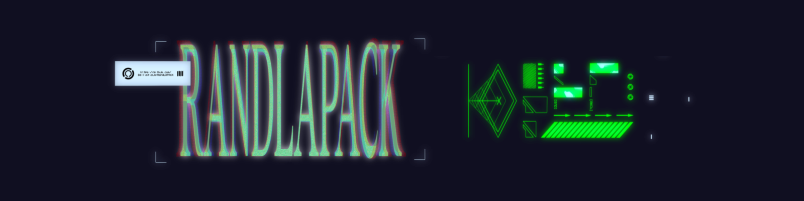

<p align="center">
  
</p>

# RandLAPACK

RandLAPACK provides high-performance randomized algorithms for linear algebra
problems such as least squares, (kernel) ridge regression, low-rank
approximation, and matrix factorizations.
RandLAPACK's API is not yet stable; we're actively working on changing that.

Please swing by [**our Discord server**](https://discord.gg/R4qj8Er9YW) if you
have questions about RandLAPACK or would like to get involved in its
development.

## Quickstart

```shell
git clone https://github.com/BallisticLA/RandLAPACK.git
cd RandLAPACK
bash install.sh
```

The installer builds RandLAPACK together with its dependencies (BLAS++,
LAPACK++, Random123; RandBLAS comes along as a pinned git submodule) and the
test and benchmark executables. Run `bash install.sh --help` for the options
(GPU support, parallelism, reusing preinstalled dependencies, and more), and
see [docs/INSTALL.md](docs/INSTALL.md) for manual installation and for consuming
RandLAPACK from your own CMake project. A smoke test after installation:

```shell
ctest --test-dir ../RandNLA-project/build/RandLAPACK-build
```

## What's in the library

The user-facing algorithms ("drivers"; see
[docs/ARCHITECTURE.md](docs/ARCHITECTURE.md) for how the library is organized):

| Driver | Problem it solves | Reference |
|--------|-------------------|-----------|
| `BQRRP` | Blocked QR with randomized column pivoting, any aspect ratio | [arXiv:2507.00976](https://arxiv.org/abs/2507.00976) |
| `CQRRPT` | Sketch-based QR with column pivoting for tall matrices | [arXiv:2311.08316](https://arxiv.org/abs/2311.08316) |
| `CQRRT` | Q-less randomized QR (preconditioner construction) | |
| `RSVD` | Randomized low-rank SVD via the QB decomposition | [arXiv:2009.06392](https://arxiv.org/abs/2009.06392) |
| `REVD2` | Randomized eigendecomposition of symmetric matrices | [arXiv:2009.06392](https://arxiv.org/abs/2009.06392) |
| `ABRIK` | Block-Krylov iterative SVD for many accurate singular triplets | |
| `HQRRP` | Householder QR with randomized pivoting | [arXiv:1512.02671](https://arxiv.org/abs/1512.02671) |
| `KRILL` | Kernel ridge regression solvers | [arXiv:2302.11474](https://arxiv.org/abs/2302.11474) |
| `RPCholesky` | Randomly pivoted Cholesky for kernel matrices | [arXiv:2207.06503](https://arxiv.org/abs/2207.06503) |

BQRRP and CQRRPT also have CUDA implementations (`*_gpu`). Drivers are
assembled from smaller randomized building blocks (rangefinders, sketching
wrappers, orthogonalization and stabilization routines) that are usable on
their own; the RandNLA monograph
([arXiv:2302.11474](https://arxiv.org/abs/2302.11474)) is the best background
reference for the algorithm families.

## Related libraries

RandLAPACK depends on [RandBLAS](https://github.com/BallisticLA/RandBLAS),
which we are also developing.

Before starting on RandLAPACK we implemented several high-level RandNLA
algorithms in Matlab ([MARLA](https://github.com/BallisticLA/marla)) and
Python ([PARLA](https://github.com/BallisticLA/parla)).
In the latter library we took an approach where *algorithms are objects.*
An algorithm needs to be instantiated with its tuning parameters and
subroutines in order to be used.
RandLAPACK currently emphasizes that "algorithms as objects" approach.

## Where to go from here

Everything beyond this page lives in two places: `docs/` for reference
documentation, and `CONTRIBUTING.md` at the root for the development
workflow.

| You want to... | Read |
|----------------|------|
| Install with one command | [docs/INSTALL_SCRIPT.md](docs/INSTALL_SCRIPT.md) |
| Install by hand, or use RandLAPACK from your CMake project | [docs/INSTALL.md](docs/INSTALL.md) |
| Understand how the library is organized | [docs/ARCHITECTURE.md](docs/ARCHITECTURE.md) |
| Contribute code | [CONTRIBUTING.md](CONTRIBUTING.md) |
| Run or add performance benchmarks | [benchmark/README.md](benchmark/README.md) |
| Use the Eigen/Matrix-Market integrations | [extras/README.md](extras/README.md) |
