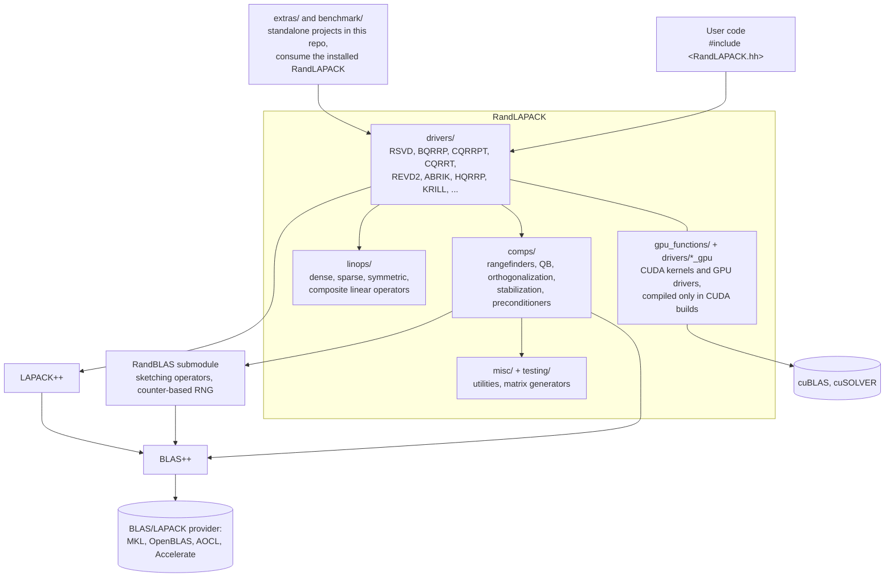

# How RandLAPACK is organized

This is the map for reading or extending the library. For installation see
[INSTALL.md](INSTALL.md); for the contribution workflow see
[CONTRIBUTING.md](../CONTRIBUTING.md).

## The one-paragraph version

RandLAPACK is a header-only C++20 template library. User code includes a
single umbrella header, `RandLAPACK.hh`, and calls **drivers**: complete
randomized algorithms (randomized SVD, QR with column pivoting, kernel ridge
regression solvers, ...). Drivers are assembled from **computational
routines** (rangefinders, orthogonalization, stabilization) and from the
sketching primitives of **RandBLAS**, which ships inside this repository as a
pinned git submodule. Dense linear algebra goes through the **BLAS++** and
**LAPACK++** wrapper libraries, so any BLAS/LAPACK provider (MKL, OpenBLAS,
AOCL, Accelerate) can sit underneath. Matrices are column-major, dimensions
are `int64_t`, and every public entry point is templated on the element type.



## Directory map

```
RandLAPACK/                     (repository root)
|-- RandLAPACK.hh               single umbrella header: the public include
|-- RandLAPACK/                 all library code (header-only templates)
|   |-- rl_blaspp.hh            BLAS++ shim
|   |-- rl_lapackpp.hh          LAPACK++ shim
|   |-- rl_exceptions.hh        RandLAPACK::Error + randlapack_require
|   |-- drivers/                user-facing algorithms (rl_rsvd.hh,
|   |                           rl_bqrrp.hh + rl_bqrrp_gpu.hh, rl_cqrrpt.hh
|   |                           + rl_cqrrpt_gpu.hh, rl_cqrrt.hh, rl_revd2.hh,
|   |                           rl_abrik.hh, rl_hqrrp.hh, rl_krill.hh, ...)
|   |-- comps/                  computational building blocks (rl_rf.hh
|   |                           rangefinders, rl_qb.hh, rl_orth.hh,
|   |                           rl_syps.hh/rl_syrf.hh, rl_rpchol.hh,
|   |                           rl_preconditioners.hh, rl_determiter.hh)
|   |-- linops/                 linear-operator abstractions used by
|   |                           matrix-free drivers
|   |-- gpu_functions/          CUDA kernels and cuSOLVER dispatch helpers
|   |                           (compiled only in CUDA translation units)
|   |-- misc/                   rl_util.hh, rl_pdkernels.hh
|   `-- testing/                matrix generators and test utilities that
|                               ship with the library (rl_gen.hh, ...)
|-- RandBLAS/                   git submodule, pinned to an exact commit
|-- test/                       GoogleTest suite, mirrors the source layout
|-- benchmark/                  standalone CMake project (see its README)
|-- extras/                     standalone CMake project (Eigen +
|                               fast_matrix_market integrations)
|-- CMake/                      build options, version, config templates
`-- install.sh                  the autoinstaller (see INSTALL_SCRIPT.md)
```

## The three-tier build

The repository builds as three CMake projects, not one:

1. **Core library** (root `CMakeLists.txt`): installs the headers and CMake
   config, and builds the test suite when `RandLAPACK_BUILD_TESTS=ON`.
   RandBLAS is built from the submodule (or, for package maintainers only,
   consumed as an installed package behind the
   `RandLAPACK_EXTERNAL_RandBLAS` commit gate; see INSTALL.md).
2. **extras/** and 3. **benchmark/**: separate downstream projects that
   consume the *installed* RandLAPACK via `find_package`, exactly like user
   code does. This keeps them honest as consumers and keeps their extra
   dependencies out of the library build. Their purposes differ: `benchmark/`
   measures RandLAPACK's performance (the harnesses behind the papers),
   while `extras/` is a holding area for functionality that currently needs
   third-party libraries (Eigen, fast_matrix_market) that core RandLAPACK
   will not depend on; see `extras/README.md` for the graduation policy.

`install.sh` drives all three in order, plus the dependency builds.

## Conventions that hold everywhere

- Column-major storage; `int64_t` for all dimensions, leading dimensions,
  and indices; element type is a template parameter `T` (float/double).
- Algorithms are objects: construct with tuning parameters, then `call(...)`.
  Outputs and workspaces are caller-provided raw buffers.
- Errors: `randlapack_require(...)` throws `RandLAPACK::Error` with a
  descriptive message; new code throws rather than asserts.
- Randomness comes exclusively from RandBLAS's counter-based generators
  (`RandBLAS::RNGState`), which makes every randomized routine reproducible
  from a seed, independent of threading.
- GPU code lives in `gpu_functions/` and `drivers/*_gpu.hh`, and is compiled
  only in CUDA translation units; the umbrella header does not include it
  (a known 1.0 work item tracks improving this).

See `../devnotes/idioms.md` (repo root) for a catalog of the C++ idioms (duck-typed
callables, workspace patterns) with rationale and examples.
